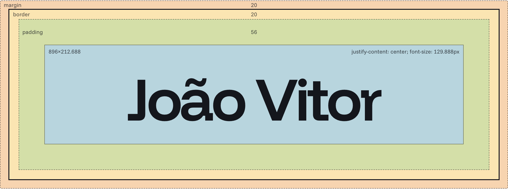
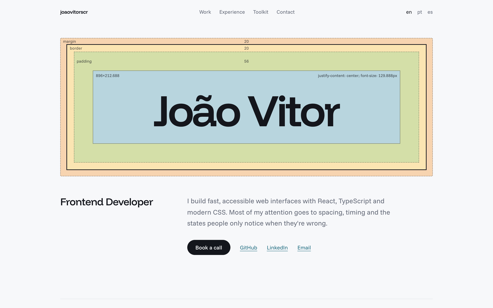
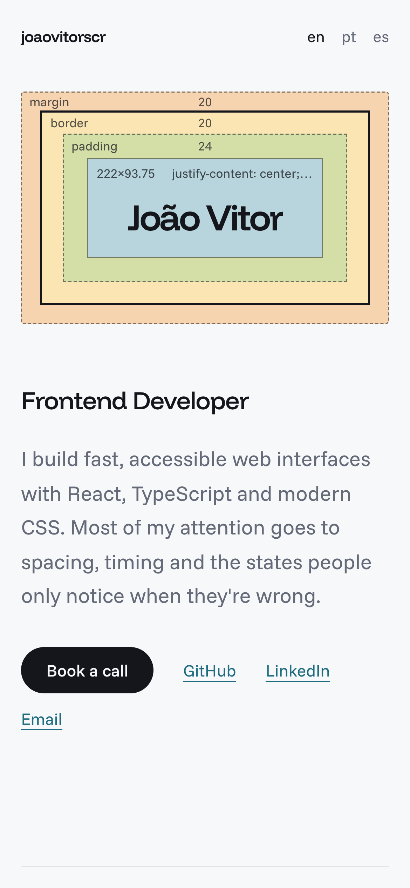

<p align="center">
  <a href="https://www.joaovitorscr.com">
    
  </a>
</p>

# joaovitorscr.com

Personal site of João Vitor, frontend developer. A single static page in three languages (English, Portuguese and Spanish), built with Astro and Tailwind and deployed on Vercel.

## Stack

- [Astro](https://astro.build) for static output, routing and self-hosted fonts
- [Tailwind CSS v4](https://tailwindcss.com) through the Vite plugin
- TypeScript, checked with `tsc`
- [oxlint](https://oxc.rs) and [oxfmt](https://oxc.rs) for linting and formatting
- pnpm, Node 22+

## Responsive layout

### Desktop

<p align="center">
  
</p>

### Phone

<p align="center">
  
</p>

## Performance

Lighthouse on a production build of `/en`, October 2026:

|                          | Mobile | Desktop |
| ------------------------ | -----: | ------: |
| Performance              |    100 |     100 |
| Accessibility            |    100 |     100 |
| Best Practices           |    100 |     100 |
| SEO                      |    100 |     100 |
| Largest Contentful Paint |  1.4 s |   0.3 s |
| Total Blocking Time      |   0 ms |    0 ms |
| Cumulative Layout Shift  |      0 |   0.002 |

The page has no images and no third-party requests. It transfers 288 KB in total: 6 KB of HTML, 5 KB of CSS, 53 KB of self-hosted fonts and 217 KB of JavaScript, almost all of it the PostHog analytics bundle, which starts only after the page has loaded.

## Structure

```
src/
  i18n/content.ts        all copy (en, pt, es), links, skills and projects
  layouts/Layout.astro   head, meta, Open Graph, JSON-LD, fonts
  pages/
    index.astro          picks a locale from the browser and redirects
    [locale]/index.astro the page, one build per locale
    404.astro
    sitemap.xml.ts
  styles/global.css      theme tokens and the hero box-model animation
public/                  favicons, app icons, OG images, manifest, robots
scripts/brand.mjs        regenerates the icons and OG images from HTML
docs/screenshots/        README screenshots
```
